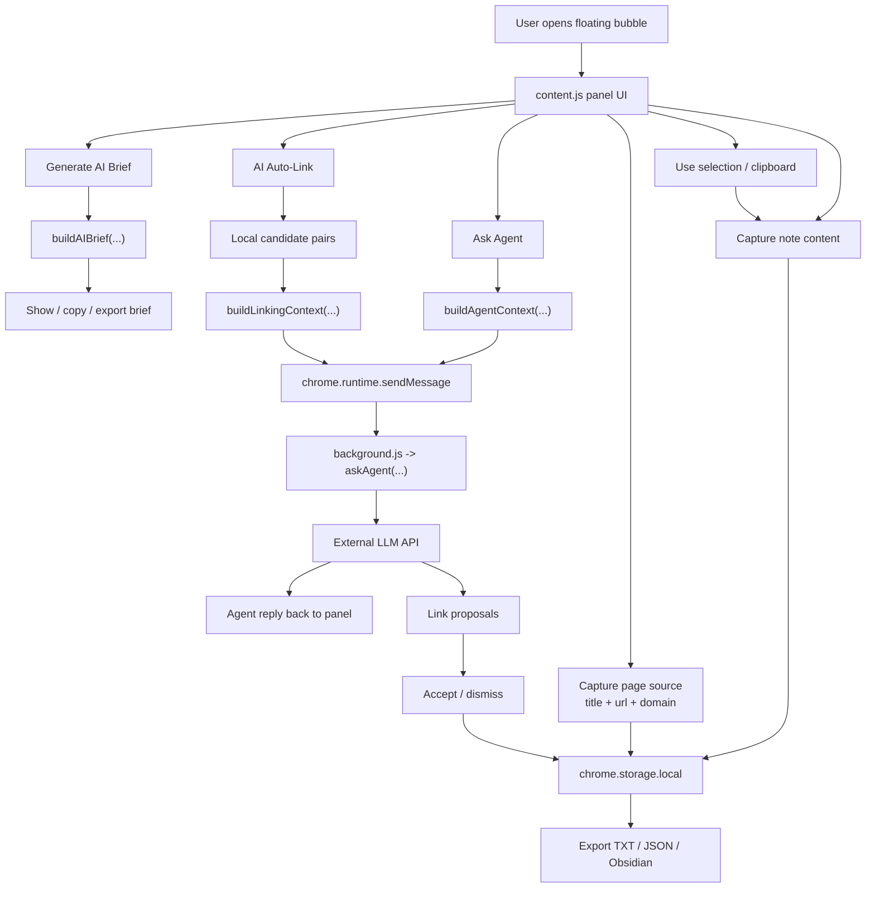

# Inspiration Hub Extension

A Chrome / Edge extension for capturing ideas while browsing, preserving their source, and turning raw notes into material for structured reflection or AI-assisted exploration.

> This project is a practical `vibe-coding` collaboration artifact: the workflow and interaction design came from real usage needs, and the implementation was iterated together with Codex.

## What It Does

Inspiration often appears in fragments while browsing:
- a new database or tool
- a useful method or workflow
- a research paper or forum post
- a product idea worth exploring later

`Inspiration Hub` is designed to capture those fragments quickly, keep the original source attached, and make them easier to organize, revisit, and discuss.

## Features

### Capture and Organize
- Floating bubble on every page
- Draggable and lockable collapsed bubble
- Click outside the panel to collapse it
- Auto-bind current page source
  - page title
  - URL
  - domain
- Capture selected text
- Read clipboard content
- Edit title, content, tags, and category
- Track notes as TODO and archive them later

### Categories and Filtering
- Categories: `Database`, `Method`, `Creative`, `Research`, `Product`, `Workflow`, `Other`
- Auto category suggestion
- Tag input
- Filter by category
- Keyword search
- Optional archived-TODO visibility

### AI-Related Features
- Configurable external LLM API
- `Ask Agent` on the currently filtered notes
- `Generate AI Brief` for exporting a structured discussion pack
- `AI Auto-Link` for note-to-note link proposals
- Accept or dismiss link proposals

### Export
- Export as `.txt`
- Export as `.json`
- Export as Obsidian-compatible `.md`
  - one file per note
  - valid as a normal note even without links
  - accepted links can be included as optional related-note metadata

## Installation

### Chrome
1. Open `chrome://extensions`
2. Enable Developer Mode
3. Click `Load unpacked`
4. Select the `inspiration-capture-extension` folder

### Edge
1. Open `edge://extensions`
2. Enable Developer Mode
3. Click `Load unpacked`
4. Select the `inspiration-capture-extension` folder

## Architecture

The extension has a simple split:
- `content.js` handles the floating UI, note editing, local context construction, and user interactions
- `background.js` handles downloads and external LLM API requests
- `chrome.storage.local` stores notes, links, UI preferences, and API settings locally

## How The AI Flow Actually Works

This project currently has **three different AI-adjacent flows**, and they are not the same thing.

### 1. `Generate AI Brief` is local, not a model call
This feature does **not** call an API.

It takes the currently filtered notes and builds a structured markdown/text briefing package locally inside the extension. That package is meant to be:
- copied into an external LLM chat
- exported for later use
- used as a compact discussion prompt

Implementation reference:
- `content.js` -> `buildAIBrief(...)`

### 2. `Ask Agent` does call an external LLM API
This feature works in two stages:
- the content script collects the filtered notes and compresses them into a text context
- the background script sends that context, your question, and the configured system prompt to the external chat-completions endpoint

Implementation references:
- `content.js` -> `buildAgentContext(...)`
- `content.js` -> `askAgentBtn` click handler + `chrome.runtime.sendMessage(...)`
- `background.js` -> `askAgent(...)`

So the current agent is not maintaining a persistent knowledge graph. It is answering based on a temporary text context assembled from the selected notes.

### 3. `AI Auto-Link` is a proposal flow, not a full autonomous graph engine
The current linking flow is:
- the extension creates candidate note pairs locally
- it builds a linking context text block
- it asks the configured LLM to judge which pairs are meaningful and what relation they may have
- the returned results are stored as suggested links

Implementation references:
- `content.js` -> `buildLinkingContext(...)`
- `content.js` -> `handleAutoLink(...)`
- `background.js` -> `askAgent(...)`

This means it is currently a **proposal system**, not yet an embedding-backed self-maintaining note graph.

## Data and Sync

- Notes and settings are stored in `chrome.storage.local`
- Chrome and Edge do **not** automatically share the same note database
- Different browser profiles are also isolated by default
- API keys are currently stored locally for convenience and are not treated as a secure vault

## Project Structure

- `manifest.json`: extension manifest
- `content.js`: UI, note handling, local brief generation, and panel interactions
- `content.css`: bubble and panel styles
- `background.js`: downloads and external agent requests

## Known Limits

- No automatic cross-browser sync yet
- The current auto-link flow is suggestion-based
- Clipboard behavior depends on page permissions
- Long-note semantic linking is not yet embedding-based

## License

This repository includes an MIT License in [`LICENSE`](./LICENSE).

